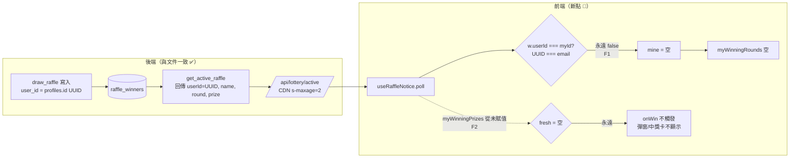

# 抽獎機制 — 文件 vs 程式碼 完整比對報告

- 產出日期：2026-07-03
- **修正完成日期：2026-07-03（F1~F5 全數處理，`typecheck` / `build` 皆通過）**
- 比對基準文件：`docs/raffle-feature.md`（抽獎中獎即時通知，最後更新 2026-06-25）
- 比對對象：現行 `main` 分支（已對齊 `origin/main`，HEAD `7fee333`）
- 目的：確認文件描述的機制與目前程式碼是否一致，標出落差與影響

> **狀態總覽**：F1~F5 皆已修正。前端 `typecheck`（vue-tsc）與 `build`（Nuxt+Nitro）均 EXIT 0。
> 唯一尚未本地驗證者為 F3 的 SQL（無本地 DB 可套用），已產出新 migration 待套用。
> 尚未 commit / push。

---

## 0. 摘要

整體後端架構、資料表、RLS、DB 函式權限、輪詢端點、雙層 gating、設定常數皆**與文件一致**。
原本**「會員手機端偵測中獎並跳通知」這條路是斷的**（F1+F2 疊加），現已修復。

| # | 嚴重度 | 主題 | 一句話 | 狀態 |
|---|---|---|---|---|
| F1 | 🔴 高 | 身分比對用錯欄位 | 拿 `email` 去比對 `userId`（UUID），永遠比不中 | ✅ 已修正 |
| F2 | 🔴 高 | `myWinningPrizes` 未賦值 | 觸發通知讀的變數從未被填 → `onWin` 永不執行、中獎卡永不顯示 | ✅ 已修正 |
| F3 | 🟡 中 | `raffle_prizes` 欄位漂移 | 文件/DB 函式用 `order`，程式已改 `drawOrder`+`prize` | ✅ 已修正（方式 A，migration 待套用） |
| F4 | 🟢 低 | `showWinModal` 死碼 | `/raffle` 自訂彈窗永遠不會開 | ✅ 已處理（改為保留＋可切換） |
| F5 | 🟢 低 | 文件用語過期 | 文件仍稱獎項欄位為 `order`、資料流描述比對「id」 | ✅ 已修正 |

> **F1 + F2 曾是疊加的**：只修其中一個，中獎通知仍不會動；本次兩個一併修復，手機端偵測與通知已恢復。

---

## 1. 比對範圍與方法

逐檔閱讀並交叉比對下列來源：

**後端 / DB**
- `supabase/migrations/20260624000001_create_raffle_winners.sql`
- `supabase/migrations/20260624000002_create_draw_raffle_function.sql`
- `supabase/migrations/20260624000003_create_get_raffle_candidates_function.sql`
- `supabase/migrations/20260625000001_create_get_active_raffle_function.sql`
- `supabase/migrations/20260701000001_add_raffle_prizes.sql`
- `supabase/full_schema.sql`（`profiles` 定義）
- `server/api/lottery/active.get.ts`、`server/utils/raffle.ts`

**前端**
- `app/config/raffle.ts`
- `app/composables/useRaffleNotice.ts`、`app/composables/useRaffleNotifier.ts`
- `app/composables/admin/raffle.ts`、`app/services/raffleAdmin.ts`
- `app/types/raffle.ts`、`app/utils/raffle.ts`
- `app/pages/raffle/index.vue`、`app/layouts/default.vue`（掛載點確認）

---

## 2. 與文件一致的部分（無落差）

| 文件章節 | 描述 | 程式碼實況 | 判定 |
|---|---|---|---|
| §3.1 | `raffle_winners` 欄位、`UNIQUE(event_id,user_id)`、索引 `(event_id,round)` | `20260624000001..sql` 完全吻合 | ✅ |
| §3.1 | `events.raffle_active` / `events.raffle_prizes` 欄位 | 兩個 migration 皆有建立 | ✅ |
| §3.1 | RLS：登入者可 SELECT、ALL 僅 admin | `raffle_winners` policy 一致 | ✅ |
| §3.2 | `draw_raffle`：驗 admin、count 1~100、排除 admin/已中獎、`round` 自動 +1 | `draw_raffle` 邏輯一致 | ✅ |
| §3.2 | 三函式權限：`draw_raffle`/`get_raffle_candidates` 不開 anon、`get_active_raffle` 開 anon | REVOKE/GRANT 一致 | ✅ |
| §3.3 | 端點用 anon key、`s-maxage=2, stale-while-revalidate=5`、非個人化 | `active.get.ts` 一致 | ✅ |
| §4.1 | `layouts/default.vue` 掛載 `useRaffleNotifier()` | `default.vue:12` 確認 | ✅ |
| §4.1 | 雙層 gating：時間窗（前端）+ `raffle_active`（後端） | `useRaffleNotifier.ts` 邏輯一致 | ✅ |
| §4.2 | 開始抽獎自動關其他場、prizeDirty 未存不能抽、逐輪抽、撤回 | `admin/raffle.ts`、`raffleAdmin.ts` 一致 | ✅ |
| §5 | `POLL_INTERVAL_MS=3000`、`GATING_BUFFER_MINUTES=30`、`RAFFLE_SMAXAGE_SECONDS=2`、`RAFFLE_SWR_SECONDS=5` | 常數一致 | ✅ |

---

## 2.1 補充：輪詢 gating 現況（時間窗驗證仍正常 ✅）

即使 F1/F2 讓中獎偵測失效，**「先驗證是否在活動時間內才輪詢」這層（第一層 gating）完全正常**，斷點不在此。

**全域機制（會員頁通用）**：`app/layouts/default.vue:12` 掛載 `useRaffleNotifier()`，輪詢前判斷在 `useRaffleNotifier.ts:52-58`：
```ts
function evaluate() {
  if (!user.value?.sub || !withinWindow()) {
    notice.stop()      // 未登入 或 不在時間窗 → 不輪詢
    return
  }
  notice.start()       // 僅在窗內才啟動每 3 秒輪詢
}
```
- `withinWindow()` 依 published 活動的 `[start_at − 30分, end_at + 30分]`（`GATING_BUFFER_MINUTES=30`）判斷。
- 進 App 先 `loadWindows()`（只抓 `end_at >= now − buffer` 的 published 活動）→ `evaluate()`。
- **每 60 秒**重新評估進出時間窗（純本地計算，不打網路）；**每 10 分鐘**重抓活動時間再評估。
- 窗外 → 完全零輪詢流量（守 Vercel 免費額度）。與文件 §4.1 一致。

**例外**：`/raffle` 測試頁（`app/pages/raffle/index.vue:22`）直接呼叫 `useRaffleNotice({ onWin })`，**未傳 `auto: false`** → 進頁即無條件輪詢、不看時間窗。此為文件標明的純調試頁，正式體驗以全域機制為準。

> 結論：gating 判斷正確——「該輪詢時確實有輪詢」；但輪到結果後，`poll()` 內部因 F1/F2 永遠判定沒中獎。**時間窗驗證沒問題，斷點在比對那一步。**

---

## 3. 落差詳述

### F1 🔴 身分比對用錯欄位（email vs UUID）　✅ 已修正

> **修正**：`useRaffleNotice.ts` 新增 `matchId = user.value?.sub`（auth uid，對應 `winners[].userId`）作為比對鍵；`myId`（email）保留給 `memberDisplay` 顯示。`poll()` gating 與 `filter` 改用 `matchId`。同步更新 `raffle-feature.md`（比對鍵澄清為 `user.sub`）。

**文件說法**（§3.3 / §4.1）
> 「是不是我」比對在前端做：比對登入者 **id** 是否在 `winners` 內。

**程式碼實況**
```ts
// app/composables/useRaffleNotice.ts:24
const myId = computed(() => user.value?.email ?? null)   // ← email

// :79
const mine = (data.winners ?? []).filter(w => w.userId === myId.value)
```
但 `winners[].userId` 的來源是：
- `get_active_raffle()` 回傳 `'userId', w.user_id`（`20260625..sql:27` / `20260701..sql:36`）
- `raffle_winners.user_id` = `profiles.id`（`20260624000001..sql:5`，FK 指向 `profiles.id`）
- `profiles.id` = `UUID`，參照 `auth.users(id)`（`full_schema.sql:14`）

因此 `w.userId` 是 **UUID**，而 `myId` 是 **email**。兩者型別/值域完全不同，`===` **永遠為 false**。

**影響**
- `mine` 恆為空陣列 → `myWinningRounds` 恆空 → 沒有任何使用者會被判定中獎。
- 連無 gating 的 `/raffle` 測試頁也一樣抓不到中獎。

**佐證旁證**：同檔 `memberDisplay`（:36-41）對 `myId` 做 `id.split('@')[0]`，顯示程式碼是**以 email 為前提**寫的；但比對鍵應該用 UUID。兩個用途被混用在同一個 `myId` 上。

**建議修法**：把「顯示用（email）」與「比對用（UUID）」拆開。
```ts
const matchId = computed(() => user.value?.id ?? null)   // 比對用，對應 winners[].userId
const myId    = computed(() => user.value?.email ?? null) // 保留給 memberDisplay 顯示
// :79 改成
const mine = (data.winners ?? []).filter(w => w.userId === matchId.value)
```

---

### F2 🔴 `myWinningPrizes` 從未被賦值 → 通知永不觸發　✅ 已修正

> **修正**：`poll()` 內由 `mine` 建出 `RaffleWinDisplay[]`（`{ round, label }`，label 取 `w.prize`，否則退回「第 N 獎」）並賦值給 `myWinningPrizes`，`fresh`/通知才會真正觸發。

**文件說法**（§4.1）
> 比對登入者 id、新輪次中獎觸發 `onWin`（含已通知去重）；命中→跳「恭喜中獎」。

**程式碼實況**
```ts
// app/composables/useRaffleNotice.ts:18
const myWinningPrizes = ref<RaffleWinDisplay[]>([])   // 宣告

// poll() 內：
// :80  只填 myWinningRounds
myWinningRounds.value = mine.map(w => w.round).sort((a, b) => a - b)
// :85  但觸發通知讀的是 myWinningPrizes（從未被賦值，恆為 [])
const fresh = myWinningPrizes.value.filter(w => !notified.has(w.round))
if (fresh.length) { addNotified(...); options?.onWin?.(fresh) }   // ← 永不進來
```
全檔搜尋，`myWinningPrizes.value` 只在 :76 被重設為 `[]`，**沒有任何一處把 `mine` 的資料寫進去**。故 `fresh` 恆空、`onWin` 永不呼叫。

**影響**
- `useRaffleNotifier` 的 `showDialog('🎉 恭喜中獎！')` 永不彈出（全域會員頁）。
- `/raffle` 頁的「恭喜！您中獎了！」卡片（`index.vue:139` `v-if="myWinningPrizes.length"`）永不顯示。

**建議修法**：在 poll 內由 `mine` 建出 `RaffleWinDisplay[]` 並賦值。獎項名稱可用 `w.prize`（DB 已帶回，見 F3），fallback「第 N 獎」。
```ts
myWinningPrizes.value = mine.map(w => ({
  round: w.round,
  label: (w.prize && w.prize.trim()) ? w.prize : `第 ${w.round} 獎`,
}))
```
> 註：`RaffleWinDisplay` 需要 `{ round, label }`（`types/raffle.ts:8`），而 `mine` 是 `RaffleWinner`（`{ userId, name, round, prize? }`），兩者不同型別，本來就需要一次 map 轉換——目前這層轉換整個缺席。

---

### F3 🟡 `raffle_prizes` JSON 欄位形狀漂移（`order` → `drawOrder`/`prize`）　✅ 已修正（方式 A）

> **修正**：新增 migration `20260703000001_fix_get_active_raffle_prize_mapping.sql`，`get_active_raffle` 改以「`drawOrder` 排序後位置對應 `round`」（保留 legacy `order` 為 fallback），與前端 `getRafflePrizeSettingByRound` 的位置語意一致；同步更新 `full_schema.sql` 基線。**待套用 DB 才生效**（無本地 DB，尚未套用驗證）。

**文件說法**（§1 / §2 / §5）
> `events.raffle_prizes` 為 `[{ order, name, count }]`；`get_active_raffle` 的 `prize` 依 `raffle_prizes[].order` 對應輪次。

**程式碼實況**
- 前端型別已改為 `{ prize, name, count, drawOrder }`（`types/raffle.ts:27-32`），**無 `order` 鍵**。
- 寫入時 `raffleAdminService.updateRafflePrizes` 直接把此形狀存進 `raffle_prizes`（`raffleAdmin.ts:54-67`）。
- 但 DB `get_active_raffle`（`20260701000001..sql:39-43`）仍以：
  ```sql
  WHERE COALESCE(NULLIF((elem ->> 'order')::int, 0), ord::int) = w.round
  ```
  對應獎項——`elem->>'order'` 在新資料是 `NULL` → 退化成用**陣列位置 `ord`（1-based）** 對 `w.round`。

**目前為何還「碰巧正確」**
- 前端 `normalizeRafflePrizeSettings` 會依 `drawOrder` 排序（`utils/raffle.ts:26-29`），存入的陣列即為排序後結果。
- 後台抽獎 `drawOne` 取獎項是 `getRafflePrizeSettingByRound(round)` = `normalize(...)[round-1]`（`utils/raffle.ts:35`），也是**用位置**。
- DB 端同樣 fallback 到位置。三方都用「位置」→ 只要獎項連續、無跳號就一致。

**風險（為何仍列中度）**
1. `drawOrder` 若有跳號（例：1、3、5），前端會壓縮成位置 1、2、3，`drawOrder` 的「語意」實質被忽略——與「依 drawOrder 對應」的直覺不符。
2. DB 函式殘留 `elem->>'order'` 這段**死邏輯**；若資料庫存在**舊格式**（含 `order` 鍵）資料，DB 會改用 `order` 值，但前端用位置 → 兩邊對不上、顯示錯獎。
3. 文件、DB、前端三處對「輪次↔獎項」的對應鍵不一致，維護者容易誤解。

**建議修法（擇一）**
- (A) 更新 DB 函式改讀 `drawOrder`（或直接以 `ord` 位置為準並移除 `order` 死邏輯），並更新文件；或
- (B) 若要保留「以 `order` 對應」語意，前端存檔時一併寫入 `order` 欄位。
- 推薦 (A)：與現行前端「位置導向」行為一致，改動最小。

---

### F4 🟢 `showWinModal` 為死碼　✅ 已處理（保留＋可切換，未移除）

> **處理**（依需求調整方向）：不移除，改為**可切換**。新增 `RAFFLE_NOTIFY_STYLE`（`config/raffle.ts`）與 `notifyStyle` 選項；`useRaffleNotice` 內 `notifyWin()` 依設定切換——`'dialog'` 走 vant `showDialog`、`'modal'` 開自訂彈窗。彈窗抽成共用元件 `components/Raffle/WinModal.vue`，掛在 `default.vue`（全站）與 `/raffle`。`useRaffleNotifier` 與 `/raffle` 移除各自的 `showDialog`，避免重複跳窗。

**現象**：`useRaffleNotice.ts` 的 `showWinModal` 只有宣告（:15）與設 `false`（:115 `closeWinModal`），**沒有任何一處設為 `true`**。
`/raffle/index.vue:154-176` 依 `showWinModal` 渲染了一個自訂 Teleport 彈窗，但因永遠不會被打開而形同死碼。實際中獎提示改由 `onWin` → `showDialog(...)`（vant）負責。

**影響**：無功能損害（只是未使用的 UI 與狀態）。
**建議**：修好 F1/F2 後，決定中獎彈窗要用 `showDialog` 還是這個自訂 modal，二擇一並移除另一個，避免混淆。

---

### F5 🟢 文件用語 / 描述過期　✅ 已修正

> **修正**：`raffle-feature.md` 已更新——獎項欄位 `order → drawOrder`（+`prize`）、輪次對應改述為「依 `drawOrder` 排序後位置」、比對鍵澄清為 `user.sub`（auth uid），並於 §5 補上 `RAFFLE_NOTIFY_STYLE` 切換說明。

- §1、§2、§3.2 仍稱獎項欄位為 `order`；現行程式為 `drawOrder` + 新增 `prize`（獎項層級標籤）。
- §3.3、§4.1 描述比對「登入者 id」——與現行程式的「email（且比對失效）」不符（見 F1）。
- 建議：修完程式後同步更新 `raffle-feature.md`，或在文件註明欄位改名歷史。

---

## 4. 資料流：文件預期 vs 目前實況



---

## 5. 建議修正順序

1. **F1**：`useRaffleNotice` 比對鍵改用 `user.value?.id`（UUID），與 `winners[].userId` 對齊；`memberDisplay` 另接 email。
2. **F2**：在 `poll()` 內把 `mine` 轉成 `RaffleWinDisplay[]` 並賦值給 `myWinningPrizes`（label 用 `prize` fallback「第 N 獎」）。
3. 以 `/raffle` 測試頁做端到端驗證（後台抽一輪 → 手機端在 ~5 秒內顯示中獎卡並跳窗）。
4. **F3**：更新 `get_active_raffle` 移除 `order` 死邏輯（或前端補寫 `order`），三方對齊。
5. **F4/F5**：清理死碼、更新 `raffle-feature.md`。

> F1、F2 屬同一條通知鏈，建議一起修並一次驗證；F3~F5 可另開一輪處理。
