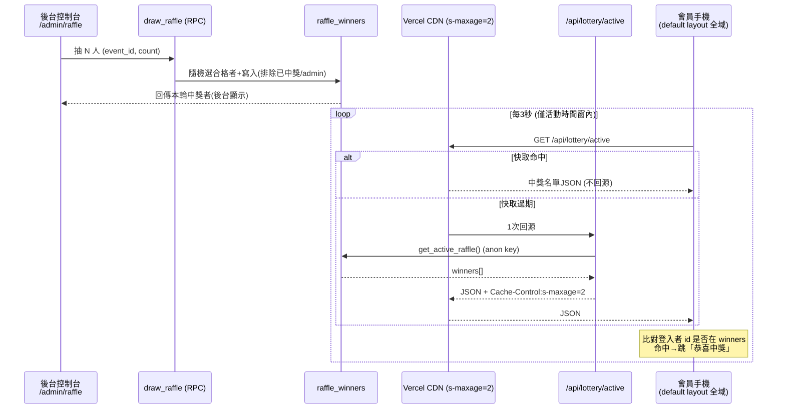
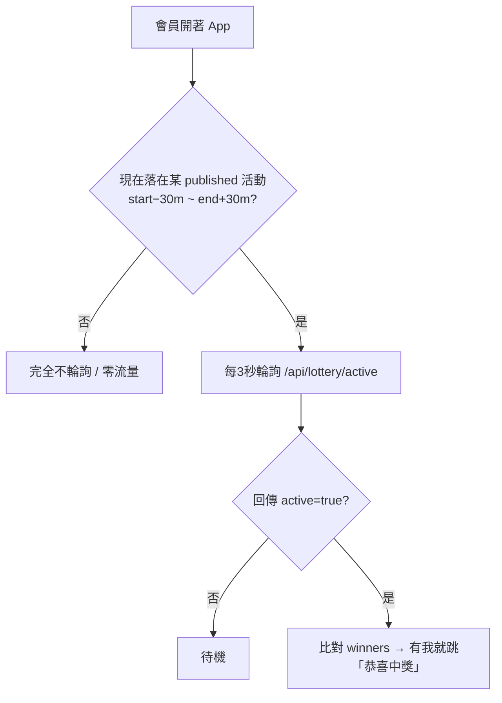

# 抽獎中獎即時通知 — 完整功能文件

最後更新：2026-06-25

活動（300~500 人）抽獎環節：主辦在後台開獎，合格者的手機在 App 內即時跳「恭喜中獎」。本文件涵蓋後端、前端、操作手冊、設定與限制。

- 設計來源：`docs/superpowers/specs/2026-06-24-raffle-winner-notification-design.md`
- 自我驗證步驟：`docs/raffle-selftest-runbook.md`
- 測試計畫：`docs/superpowers/plans/2026-06-24-raffle-winner-notification-test-plan.md`

## 1. 核心設計原則

> **寫入（誰中獎）走 DB 函式保證公正；讀取（手機查詢）走 CDN 快取端點吸收流量。**
> 全程不使用 Supabase Realtime（避開免費版 ~200 連線上限），改以 HTTP 輪詢 + Vercel CDN 快取，把 500 支手機的流量壓到「每約 2 秒回源 1 次」。

- 合格條件：`profiles.points >= events.raffle_threshold` 且 `role <> 'admin'`；同活動已中獎者後續排除。
- 通知形式：**僅 App 內提示**（不做背景 Web Push）。手機鎖屏/切背景會暫停，重開才補看到。
- 可接受延遲：3~5 秒（實測最壞約 5 秒內）。

## 2. 架構與資料流

## 3. 後端

### 3.1 資料表

| 物件 | 說明 |
|---|---|
| `raffle_winners` | 中獎名單：`id, event_id, user_id, round, name, points, created_at`；`UNIQUE(event_id, user_id)`（同活動不重複中獎）；索引 `(event_id, round)` |
| `events.raffle_active` | `boolean DEFAULT false`：標記目前哪場活動正在抽獎（手機 gating 第二層開關） |

RLS（`raffle_winners`）：登入者可 SELECT；ALL 僅 admin（`is_admin`）。

### 3.2 DB 函式（皆 `SECURITY DEFINER`）

| 函式 | 權限 | 用途 |
|---|---|---|
| `draw_raffle(p_event_id, p_count)` | authenticated（內部驗 admin） | 一次交易內隨機抽 `count`（1~100）人、排除 admin 與已中獎者、`round` 自動 +1、寫入並回傳本輪中獎者 |
| `get_raffle_candidates(p_event_id)` | authenticated（內部驗 admin） | 回傳合格者 `id, name`（後台顯示合格人數 / 未來大螢幕跑馬燈） |
| `get_active_raffle()` | **anon** + authenticated | 回傳目前 `raffle_active` 活動的中獎名單，只吐 `userId/name/round`；供輪詢端點用 |

> `draw_raffle` / `get_raffle_candidates` **不開放 anon**；只有 `get_active_raffle` 開放 anon，且只吐公開的中獎資訊。

### 3.3 輪詢端點 `GET /api/lottery/active`

檔案：`server/api/lottery/active.get.ts`

- 以**既有公開 anon key**（`SUPABASE_KEY`）server 端 `$fetch` 呼叫 `get_active_raffle()` RPC，**不需 service role key**。
- 回應非個人化、不設 cookie，帶 `Cache-Control: public, s-maxage=2, stale-while-revalidate=5` → Vercel CDN 吸收絕大多數流量。
- 回傳：`{ active: false }` 或 `{ active: true, eventId, round, winners: [{ userId, name, round }] }`。
- 「是不是我」比對在**前端**做（端點對所有人一致才可被快取）。

## 4. 前端

### 4.1 全域中獎通知（正式機制）

| 檔案 | 角色 |
|---|---|
| `app/composables/useRaffleNotice.ts` | 核心：輪詢端點、比對登入者 id、新輪次中獎觸發 `onWin`（含已通知去重）。`auto` 選項控制是否自動開始 |
| `app/composables/useRaffleNotifier.ts` | 包一層**雙層 gating**，掛在會員版型 |
| `app/layouts/default.vue` | 呼叫 `useRaffleNotifier()` → 所有**會員頁**全域生效 |

**雙層 gating**：

- 第一層（前端、零成本）：抓 published 活動時間窗判斷是否輪詢，buffer 可調。每 60 秒重評估、每 10 分鐘重抓活動。
- 第二層（後端）：`events.raffle_active` 由後台控制台開關。

**只通知一次**：已通知過的輪次存於 `localStorage`（key `raffle:notified:{eventId}:{userId}`），所以**重整頁面不會重複跳窗**；同一輪只跳一次，之後若有**新輪次**中獎才會再跳。
- 測試時若要對「同帳號同一輪」重看彈窗，需先清掉該 localStorage key（DevTools → Application → Local Storage），或用無痕視窗、或抽新的一輪。

### 4.2 後台抽獎控制台 `/admin/raffle`

| 檔案 | 角色 |
|---|---|
| `app/pages/admin/raffle.vue` | 控制台頁（admin layout + `['auth','admin']` middleware） |
| `app/composables/admin/raffle.ts` | `useAdminRaffle`：選活動、開始/結束、抽一輪、撤回、讀結果 |
| `app/services/raffleAdmin.ts` | 資料層：`draw_raffle` / `get_raffle_candidates` / 切 `raffle_active` / 讀寫 `raffle_winners` |
| `app/pages/admin/index.vue` | 管理首頁「抽獎控制」入口 |

功能：選活動 → 顯示合格人數 → 開始抽獎（自動關掉其他場，確保同時只有一場）→ 設每輪幾位 → 逐輪「抽這一輪」→ 依輪次顯示中獎名單、每輪可撤回（含確認）→ 結束抽獎。

**「每輪抽幾位」是設定，需按「套用」確認**：
- stepper 的 `+ / −` 只改**草稿值**，不會抽獎、不打後端。
- 按 **套用** 才把草稿值變成「實際抽獎用的位數」（`confirmedCount`，預設 1、上限 100）；未套用會顯示提示。
- 按 **抽這一輪** 用**已套用**的位數呼叫 `draw_raffle(event, count)`，一次抽出剛好那麼多位（round 自動 +1）。
- 已套用的位數抽完不歸零，下一輪沿用（要改再調 stepper + 套用）。

**開始抽獎防呆（非活動時段警告）**：
- 後端 `draw_raffle` / 端點**不檢查活動時間**，但前端全域通知的第一層 gating 會。
- 若按「開始抽獎」時**現在不在該活動時間窗**（`[start−30分, end+30分]`），會先跳確認：「現在不在活動時段，一般使用者收不到通知，仍要開始嗎？」—— 提醒但不強制阻擋（仍可用於測試）。
- 含意：**正式抽獎要在活動時段內進行**，否則一般使用者頁面不會輪詢、收不到通知（只有無 gating 的 `/raffle-test` 看得到）。

### 4.3 測試頁 `/raffle-test`

`app/pages/raffle-test.vue`：**無 gating**、純前端調試用，顯示我的 id、目前輪次、是否中獎與原始回應，方便任何時間驗證單頁效果。正式體驗以 4.1 全域為準。

## 5. 設定值（集中管理）

| 檔案 | 常數 | 預設 | 說明 |
|---|---|---|---|
| `server/utils/raffle.ts` | `RAFFLE_SMAXAGE_SECONDS` | 2 | 端點 CDN 快取秒數 |
| | `RAFFLE_SWR_SECONDS` | 5 | stale-while-revalidate |
| `app/config/raffle.ts` | `POLL_INTERVAL_MS` | 3000 | 手機輪詢間隔 |
| | `GATING_BUFFER_MINUTES` | 30 | 第一層 gating 時間窗前後緩衝 |

## 6. 主辦操作手冊（活動當天）

1. admin 登入 → 管理首頁 → **抽獎控制**。
2. 選擇本次抽獎的活動（確認 `raffle_threshold` 與合格人數正確）。
3. 按 **開始抽獎**（系統自動關掉其他場）。
4. 設定「這一輪抽幾位」→ 按 **抽這一輪**；要多輪就重複按（round 自動累加）。
5. 中獎者手機在約 5 秒內跳「恭喜中獎」；大螢幕可同時展示後台名單。
6. 抽錯了 → 對該輪按 **撤回本輪**（被撤回者可在後續輪次再被抽中）。
7. 全部抽完 → 按 **結束抽獎**。

## 7. 免費版額度策略

| 項目 | 評估 |
|---|---|
| Realtime 連線上限 | 完全避開（不用 Realtime） |
| Supabase DB 壓力 | CDN 快取後回源約每 2 秒 1 次 + 幾次抽獎 RPC → 極低 |
| Vercel 流量 | 因第一層 gating 綁活動時段：500 人 × 每 3 秒 × 約 2 小時 ≈ 1~2GB，遠低於 Hobby 100GB |
| 環境變數 | 只需 `SUPABASE_URL` / `SUPABASE_KEY`（**無** service role key） |

## 8. 限制與已知事項

- **僅 App 內提示**：鎖屏 / 切背景會暫停輪詢，重開才補看到（未做背景 Web Push）。
- **延遲**：`s-maxage=2` + 輪詢 3 秒，最壞約 5 秒內跳出。
- **多人同時操作後台**：`round` 理論上可能撞號，單一主持人風險極低，未加 advisory lock。
- **Migration 結構**：本專案 migration 非自足（基線靠 `full_schema.sql`），詳見 PROJECT_GUIDE §9.1。

## 9. 檔案清單

**後端**
- `supabase/migrations/20260624000001_create_raffle_winners.sql`
- `supabase/migrations/20260624000002_create_draw_raffle_function.sql`
- `supabase/migrations/20260624000003_create_get_raffle_candidates_function.sql`
- `supabase/migrations/20260625000001_create_get_active_raffle_function.sql`
- `supabase/full_schema.sql`（第 9 節）
- `server/api/lottery/active.get.ts`、`server/utils/raffle.ts`

**前端**
- `app/config/raffle.ts`
- `app/composables/useRaffleNotice.ts`、`app/composables/useRaffleNotifier.ts`
- `app/composables/admin/raffle.ts`、`app/services/raffleAdmin.ts`
- `app/pages/admin/raffle.vue`、`app/pages/raffle-test.vue`
- `app/layouts/default.vue`（掛載全域通知）、`app/pages/admin/index.vue`（入口）

## 10. 後續可擴充（未做）

- 大螢幕展示頁（跑馬燈動畫 + 揭曉），用 `get_raffle_candidates` 餵名單。
- 背景推播（Web Push / Service Worker）。
- 未中獎者狀態顯示。
- advisory lock 防 round 撞號。
