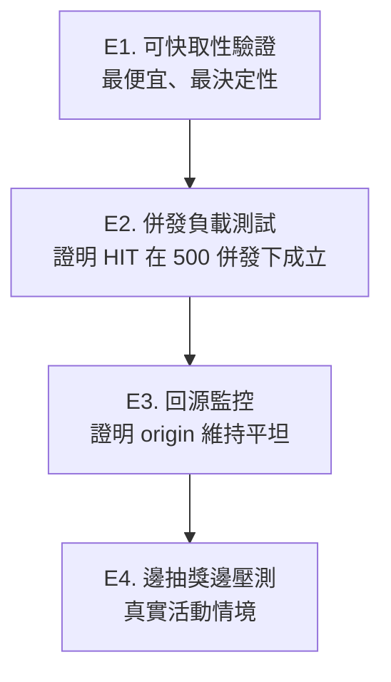
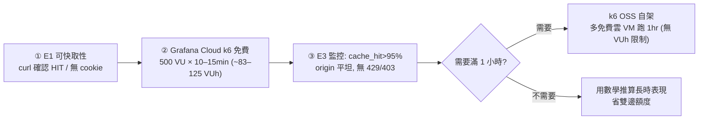

# 抽獎機制測試 Runbook

涵蓋：**A. UI 完整流程**（前端＋後端，推薦）、**B. 後端資料管線驗證**（Studio + curl，純後端）、**C. 重置與清理**、**D. 注意事項**、**E. 負載測試（300–500 人情境）**。
功能全貌見 `docs/raffle-feature.md`。

---

## A. UI 完整測試流程（推薦）

### 前置

1. **把站台跑起來**（二選一）：
  - 本機：`pnpm dev` → `http://localhost:3000`（手機測：`pnpm dev --host` + 區網 IP）
  - 線上：push 到 GitHub 讓 Vercel 部署 → `https://<app>.vercel.app`
  - 確認 `.env`（或 Vercel env）`SUPABASE_URL`/`SUPABASE_KEY` 指向要測的專案。
2. **兩個帳號**：一個 `admin`、一個一般 user（例 `test0531@example.com`），各開一個視窗/裝置登入。
3. **讓 user 有資格中獎**：合格條件是 `points >= 活動門檻`。新帳號 points=0，最簡單就是把要抽的活動**門檻設 0**：
  ```sql
  UPDATE public.events SET raffle_threshold = 0 WHERE id = '<EVENT_UUID>';
  ```

### A1. admin 開獎（後台控制台）

1. admin 登入 → 管理首頁 → **抽獎控制**（`/admin/raffle`）
2. 選那場活動 → 確認「合格人數」≥ 1（含測試 user）
3. 按 **開始抽獎**（系統自動關掉其他場）。若現在不在活動時間窗會跳警告——測試時可選「仍要開始」，但這樣只有 `/raffle/index.vue` 看得到（見 D 注意事項）。
4. 用 `+ / −` 設「每輪抽幾位」→ 按 **套用**（草稿值才生效）→ 按 **抽這一輪**（真正開獎；多按幾次＝多輪，提高測試 user 被抽中機率）

### A2. user 看顯示效果（兩種看法）

| 方式 | 怎麼開 | 條件 |
|---|---|---|
| **測試頁（最簡單，隨時可測）** | 開 `/raffle/index.vue` | 無 gating，必定輪詢；顯示我的 id / 目前輪次 / 是否中獎 / 原始回應，中獎跳窗 |
| **正式全域體驗** | 停在**任何會員頁**（首頁等） | 需「現在」落在該活動 `[start−30分, end+30分]` 時間窗內，否則第一層 gating 會擋住不輪詢 |

→ 測試 user 被抽中後，**約 5 秒內**跳「🎉 恭喜中獎」，且**同一輪只跳一次**（重整也不重複）。

### A3.（選用）指定某帳號「必中」做畫面驗證

不靠隨機，直接讓指定帳號中獎（前提：已有一場 `raffle_active=true`、該帳號開著 `/raffle/index.vue` 或會員頁）：
```sql
INSERT INTO public.raffle_winners (event_id, user_id, round, name, points)
SELECT e.id, p.id, 1, p.name, p.points
FROM public.events e, public.profiles p
WHERE e.raffle_active = true AND p.email = 'test0531@example.com'
ON CONFLICT (event_id, user_id) DO NOTHING;
```

### A 觀察重點

| 觀察 | 代表 |
|---|---|
| 控制台「合格人數」正確 | `get_raffle_candidates` 正確 |
| 抽 N 位就出現 N 位、round 累加 | `draw_raffle` + 設定值正確 |
| 第二輪不重複中獎 | 去重正確 |
| 中獎者裡沒有 admin | 排除主辦正確 |
| user 中獎 ~5 秒跳窗、重整不重跳 | 前端比對 + 只通知一次正確 |
| 撤回本輪後該輪消失 | 撤回正確 |

---

## B. 後端資料管線驗證（Studio + curl，純後端）

不經前端，直接驗「開獎 → 端點取得中獎名單」。手機端 = 瀏覽器或 curl 打 `/api/lottery/active`。

### ① 基準
開 `http://localhost:3000/api/lottery/active` → `{ "active": false }`

### ② 建測試活動並開始抽獎（門檻 0 讓所有 member 合格）
```sql
UPDATE public.events SET raffle_active = false WHERE raffle_active = true;
INSERT INTO public.events (title, start_at, end_at, status, raffle_threshold, raffle_active)
VALUES ('__selftest__', now(), now() + interval '2 hours', 'published', 0, true);
```

### ③ 端點重整 → `{ "active": true, "eventId": "...", "round": 0, "winners": [] }`

### ④ 開獎抽 2 人（模擬 admin，兩行一起執行）
```sql
SELECT set_config('request.jwt.claims',
  json_build_object('sub',(SELECT id FROM public.profiles WHERE role='admin' LIMIT 1),'role','authenticated')::text, true);
SELECT user_id, round, name
FROM public.draw_raffle((SELECT id FROM public.events WHERE title='__selftest__' ORDER BY created_at DESC LIMIT 1), 2);
```

### ⑤ 端點重整 → winners 出現（`round: 1`、2 位）

### ⑥ 「是不是我」：拿任一中獎者 `userId` 對 `profiles.id`，對得上 → 那人手機會跳中獎

### ⑦ 多輪：再跑 ④（改抽 3 人）→ `round: 2`、新中獎者、前一輪不重複

### ⑧ 結束抽獎
```sql
UPDATE public.events SET raffle_active = false WHERE title = '__selftest__';
```

### B 觀察重點

| 觀察 | 代表 |
|---|---|
| ③ winners 空、⑤ 開獎後出現 | 開獎 → 端點同步 OK |
| ⑦ 第二輪不重複中獎 | 去重正確 |
| 中獎者裡沒有 admin | 排除主辦正確 |
| Response header 有 `Cache-Control: s-maxage=2, ...` | CDN 快取會生效（真正快取要 Vercel，看 `x-vercel-cache: HIT`） |
| ④ 不先 `set_config` 直接 draw → 報 `forbidden` | 權限防護正確 |

---

## C. 重置與清理

### C1. 通知重置（localStorage）— 想對「同帳號同一輪」重看彈窗

瀏覽器 Console（F12）貼這行，只清抽獎通知記錄、不動登入狀態，再重整：
```js
Object.keys(localStorage).filter(k => k.startsWith('raffle:notified:')).forEach(k => localStorage.removeItem(k))
```
> 不要用 `localStorage.clear()`（會清掉 Supabase 登入 session）。手機不便開 Console 就用無痕視窗、或抽新一輪。

### C2. 測試資料清理（DB）

Supabase Studio SQL Editor（測試專案，安全）：
```sql
-- 1) 關掉所有進行中的抽獎
UPDATE public.events SET raffle_active = false WHERE raffle_active = true;

-- 2) 刪掉測試用活動（cascade 一併清掉該活動中獎名單）
DELETE FROM public.events WHERE title = '__selftest__';

-- 3) 清掉測試假名的中獎資料
DELETE FROM public.raffle_winners WHERE name = '測試王小明';
```
其他選項：
```sql
-- 清某活動的全部中獎名單（保留活動）
DELETE FROM public.raffle_winners WHERE event_id = '<EVENT_UUID>';
-- 或整張清空（測試專案才這樣做）
DELETE FROM public.raffle_winners;
```
查殘留：
```sql
SELECT event_id, round, name, created_at FROM public.raffle_winners ORDER BY created_at DESC;
SELECT id, title, raffle_active FROM public.events WHERE raffle_active = true OR title = '__selftest__';
```
> 也可改用後台 UI：`/admin/raffle` 選活動 → 每輪「撤回本輪」→「結束抽獎」（但 SQL 建的 `__selftest__` 活動要從清單消失仍需 `DELETE FROM events`）。

---

## D. 注意事項

- **延遲**：本機即時；上 Vercel 後 `s-maxage=2` + 輪詢 3 秒，最壞約 5 秒內跳出（設計值）。
- **僅 App 內提示**：鎖屏 / 切背景會暫停輪詢，重開才補看到（未做背景推播）。
- **gating**：正式全域通知只在活動時間窗內輪詢；要測「全域」就讓活動時間涵蓋現在，或直接用 `/raffle/index.vue`（無 gating）。
- **`draw_raffle` 回 0 筆**：代表沒有合格 member（`points ≥ 門檻` 且非 admin），降低門檻或塞測試 member。
- **CDN 命中率 / 免費額度**：需 Vercel 環境，對端點連打觀察 `x-vercel-cache: HIT`（見測試計畫 L4）。

---

## E. 負載測試（300–500 人情境）

驗證活動當天 300–500 人同時在線是否撐得住，並觀察 Vercel / Supabase 用量。

### E0. 核心觀念（先讀，決定整個測法）

> **只要 Vercel CDN 真的命中，origin（Supabase）負載與「人數、時長」無關** —— 500 人輪詢和 5 人輪詢，回源次數一樣（每約 2 秒 1 次）。

所以「撐不撐得住」本質上等於「**併發下 CDN 是不是真的 HIT**」。測試三層遞進：



⚠️ **前提**：CDN 快取**只在 Vercel 部署站台生效**，本機 `pnpm dev` 測不出來。以下全部打 `https://<app>.vercel.app/api/lottery/active`，不是 localhost。

⚠️ **鐵則**：**先短跑確認 cache HIT，再跑長時間 / 大規模**。若快取沒中（例如端點被注入 `set-cookie`），一小時就可能逼近 Vercel Hobby 月額度，超額會被**鎖 30 天**（見 E5）。

### E1. 可快取性驗證（最重要，先做）

連打同一端點看 header：

```bash
for i in $(seq 1 20); do
  curl -s -o /dev/null -D - https://<app>.vercel.app/api/lottery/active \
    | grep -iE 'x-vercel-cache|cache-control|set-cookie'
done
```

| 檢查 | 期望 | 不符代表 |
|---|---|---|
| `x-vercel-cache` | 幾次 MISS 後變 **HIT / STALE** 為主 | 沒命中 → 500 人會全打回源，免費版會爆 |
| `cache-control` | `public, s-maxage=2, stale-while-revalidate=5` | 端點沒設對 |
| `set-cookie` | **完全沒有** | 有 cookie → Vercel 直接不快取（致命） |

> `set-cookie` 這條最易被忽略也最致命：`@nuxtjs/supabase` 有時會在某些 route 注入 cookie，要確認這條端點乾淨。

### E2. 併發負載測試（k6，分階段）

用 k6 模擬手機輪詢，**分階段 ramp + threshold 超標自動中止**，避免盲跑燒額度：

```js
// raffle-load.js  —  k6 run raffle-load.js
import http from 'k6/http'
import { sleep, check } from 'k6'
import { Rate } from 'k6/metrics'

const cacheHit = new Rate('cache_hit')
const TARGET = 'https://<app>.vercel.app/api/lottery/active'

export const options = {
  scenarios: {
    // 分三階段：先驗壓測機與快取，再逐步加壓
    ramp: {
      executor: 'ramping-vus',
      startVUs: 0,
      stages: [
        { duration: '2m', target: 50 },   // ① 50 VU：確認壓測機與快取
        { duration: '3m', target: 50 },
        { duration: '2m', target: 200 },   // ② 200 VU：併發下仍 HIT?
        { duration: '3m', target: 200 },
        { duration: '2m', target: 500 },   // ③ 500 VU：目標規模
        { duration: '5m', target: 500 },
        { duration: '1m', target: 0 },
      ],
      gracefulRampDown: '30s',
    },
  },
  thresholds: {
    http_req_failed: [{ threshold: 'rate<0.01', abortOnFail: true }], // 錯誤率>1% 立刻中止
    cache_hit: ['rate>0.95'],            // CDN 命中（HIT+STALE）> 95%
    http_req_duration: ['p(95)<800'],    // p95 < 800ms
  },
}

export default function () {
  const res = http.get(TARGET)
  const cache = (res.headers['X-Vercel-Cache'] || '').toUpperCase()
  cacheHit.add(cache === 'HIT' || cache === 'STALE') // HIT 與 STALE 都算「CDN 扛住」
  check(res, {
    'status 200': (r) => r.status === 200,
    'not challenged': (r) => r.status !== 429 && r.status !== 403, // 被 firewall 擋會失真
  })
  sleep(3) // 對齊 app/config/raffle.ts 的 POLL_INTERVAL_MS
}
```

**判讀**：`cache_hit > 95%` + `http_req_failed < 1%` + 沒大量 429/403 = 撐得住。真實情境更輕鬆（手機不會完美同步、會員陸續進場、現場分散）。

> 每階段先看「Supabase 是否平坦、cache_hit 是否達標」再放心進下一階；有問題會在便宜的階段就被 `abortOnFail` 攔下。

### E3. 回源監控（壓測同時看，證明 origin 平坦）

| 看哪裡 | 期望 | 異常代表 |
|---|---|---|
| **Supabase → Reports → API**（REST 請求數） | 維持**每秒個位數**（每 edge region 每 2 秒 1 次） | 隨人數暴衝 → **快取沒中**（最該抓的問題） |
| **Vercel → Observability** | Edge Requests 遠大於 Function Invocations | 兩者接近 → 快取沒生效 |

> 壓測**前後各記一次** Vercel/Supabase 的累積用量，算**差值**才是這次測試真實消耗（dashboard 顯示的是月累計）。

### E4. 邊抽獎邊壓測（真實情境）

壓測還在跑時，另開 `/admin/raffle` 觸發開獎，確認：
1. 中獎名單在 **~5 秒內** 反映到端點回應（`s-maxage=2` + 輪詢 3 秒的設計上限）。
2. 開獎當下 Supabase / Vercel **沒有尖峰**（抽獎只是幾次 RPC，不是流量來源）。
3. 真有手機（或 `/raffle/index.vue`）在跑 → 確認跳窗、且同一輪只跳一次。

### E5. Vercel Hobby（免費版）額度與防火牆注意事項

**月額度**（官方 `/docs/limits`，2026-06 確認）：

| 項目 | Hobby 額度 | 對壓測的意義 |
|---|---|---|
| Function Invocations | **100 萬/月** | **只有 cache MISS 才算**；快取失效時 1hr×500 ≈ 60 萬次，吃掉月額度 60% |
| Fast Data Transfer（edge→手機） | **100 GB/月** | 一次測試 ~0.3–0.6 GB，輕鬆 |
| Fast Origin Transfer（origin→edge） | **僅 10 GB/月** | 只有 MISS 回源才算，每筆很小 |
| Edge Requests | Hobby 未明列（**連 HIT 都算**） | 1hr×500 = 60 萬次，**請先在 Dashboard → Usage 確認當月額度與已用量** |
| Function timeout | 預設 10s / 上限 60s | 端點遠低於 |

- **超額後果**：Hobby **無 on-demand 超量計費**，直接停用功能、**要等 30 天週期過才恢復**。風險是「服務被鎖」，不是花錢。

**防火牆 / DDoS（自動開啟、Hobby 無法關）**：
- 自動 DDoS mitigation 在所有方案（含 Hobby）預設開啟，用數百個訊號**指紋化請求模式**，像攻擊就 challenge / block（L3/L4/L7）。
- **單一 IP 每秒 ~167 req 連續測試，可能被判異常 → 被擋**（回 429/403，數據失真；被擋流量不計費）。`Pause System Mitigations` / `System Bypass Rules` 是 **Pro/Enterprise 限定**，Hobby 無法放行自己。
- 真實現場 300–500 支手機常走**同一場地 NAT IP**，所以「單一來源大量請求」其實接近活動樣態；差別是現場是真瀏覽器（較不被判攻擊），k6 裸請求較易被指紋。要逼近現場用**真瀏覽器型**雲端壓測較準。

### E6. 免費雲端壓測方案（取得多 IP）

| 方案 | 免費額度 | 適用 |
|---|---|---|
| **Grafana Cloud k6**（推薦） | **500 VUh/月**、多區域多 IP、免信用卡 | 短跑驗證最佳；protocol VU=1×、**browser VU=10×** |
| **k6 OSS 自架** | 無上限（跑自己機器） | 搭配免費雲 VM（Oracle Always Free、GCP/AWS free tier、Fly.io）分散 IP，跑長時間 |
| BlazeMeter / Loader.io 等 | 併發常卡在 <50 | 撐不起 500，**不推薦** |

⚠️ **VUh 數學（VUh = VU × 小時）**：

| 測試 | 消耗 | 占 Grafana 免費 500 VUh |
|---|---|---|
| 500 VU × **1 小時** | **500 VUh** | **整月用光（一次性）** |
| 500 VU × 10 分鐘 | ~83 VUh | 17% |
| 200 VU × 10 分鐘 | ~33 VUh | 7% |
| 500 VU × 5 分鐘（browser，10×） | ~420 VUh | 84% |

→ **完整 1 小時 500 人 = 一次把免費額度花光**，沒得重來。

### E7. 建議跑法（同時省 Vercel 與壓測額度）

你其實**不需要真的跑滿 1 小時**：一旦證明「快取會 HIT、origin 平坦」，origin 負載就**與時長、人數無關**。1 小時版本多測的只是「快取長時間會不會被 evict」+「累積額度」——前者 10–15 分鐘看得出趨勢，後者用數學推算即可。



1. **E1 先 curl 確認快取**（最便宜、最決定性）。
2. **Grafana Cloud k6 免費**跑分階段（E2），到 500 VU × 10–15 分鐘即可——多 IP、有現成 dashboard，只花約 1/4 月額度。
3. 同步看 **E3 監控**，確認 Supabase 平坦、無 firewall 誤擋。
4. 真要看滿 1 小時 → 改 **k6 OSS 自架在多台免費雲 VM**（無 VUh 限制），避開託管額度天花板。
5. 想完全規避「鎖 30 天」風險，可考慮壓測期間**短暫升 Pro**（有超量計費、可暫停 mitigation），測完降回。

### E 觀察重點

| 觀察 | 代表 |
|---|---|
| `x-vercel-cache` 以 HIT/STALE 為主 | CDN 生效、人數與 origin 解耦 |
| 加壓到 500 VU，Supabase REST 仍每秒個位數 | origin 維持平坦，撐得住 |
| `cache_hit > 95%`、`http_req_failed < 1%` | 併發下快取穩定 |
| 大量 429/403 出現 | 被 firewall 誤擋（換多 IP / 雲端壓測） |
| Supabase 用量隨人數暴衝 | 快取失效（查 `set-cookie` / `cache-control`） |
