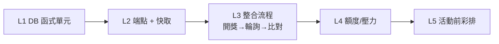

# 抽獎中獎即時通知（後端）測試計畫

- 日期：2026-06-24
- 對象：Spec `2026-06-24-raffle-winner-notification-design.md` / Plan `2026-06-24-raffle-winner-notification-backend.md`
- 前提：本專案目前**無自動化測試框架**，故以「可重現的手動驗證（SQL / curl / 觀測）」為主，並在文末附「若要自動化」的建議。
- 最重要目標：**活動當天不出包**。除了功能正確，特別驗證「免費版額度撐得住 300~500 人」與「正式彩排」。

## 1. 測試層次

| 層次 | 範圍 | 工具 |
|---|---|---|
| L1 | `draw_raffle`、`get_raffle_candidates` 行為與防護 | Supabase SQL editor |
| L2 | `/api/lottery/active` 回應格式、快取標頭 | curl / 瀏覽器 |
| L3 | 端到端：開獎 → 端點反映 → 前端比對中獎 | curl + DB |
| L4 | CDN 命中率、Supabase/Vercel 用量 | curl 連打 / Dashboard |
| L5 | 正式情境彩排（多輪、多人手機） | 真機 + 大螢幕 |

## 2. 測試資料準備（seed）

於測試（非正式）Supabase 專案準備：

| 資料 | 數量 / 設定 |
|---|---|
| 測試活動 A | `status='published'`、`raffle_threshold=2000`、`raffle_active=false`、`start_at/end_at` 設為「現在」附近 |
| profiles：合格者 | ≥ 20 筆 `points >= 2000`、`role='member'` |
| profiles：不合格者 | ≥ 5 筆 `points < 2000`、`role='member'` |
| profiles：admin | ≥ 1 筆 `points >= 2000`、`role='admin'`（用來驗證「admin 不被抽中」與「admin 才能開獎」） |

> 建議寫成一份 `seed.sql` 暫存於 scratchpad，測完即丟，不進 repo。

## 3. L1 — DB 函式測試案例

模擬登入：`SELECT set_config('request.jwt.claims', json_build_object('sub','<UUID>','role','authenticated')::text, true);`

| ID | 案例 | 步驟 | 預期 |
|---|---|---|---|
| L1-01 | 非 admin 不能開獎 | 不設 jwt（或設 member），呼叫 `draw_raffle(A,1)` | 報 `forbidden: admin only` |
| L1-02 | admin 正常開獎 | 設 admin jwt，`draw_raffle(A,2)` | 回 2 筆、`round=1`、皆為合格 member |
| L1-03 | 排除不合格者 | 同上後檢查中獎者 points | 全部 `>= 2000` |
| L1-04 | 排除 admin | 檢查中獎者 role | 無 `role='admin'`（admin_leak=0） |
| L1-05 | 同活動不重複中獎 | 連抽 `draw_raffle(A,3)` | 第 2 輪 `round=2`、與第 1 輪 user 無交集 |
| L1-06 | count 下限 | `draw_raffle(A,0)` | 報 `invalid count` |
| L1-07 | count 上限 | `draw_raffle(A,101)` | 報 `invalid count` |
| L1-08 | 合格者不足 | 合格者剩 1 人時 `draw_raffle(A,5)` | 回 1 筆，不報錯 |
| L1-09 | 活動不存在 | `draw_raffle('00000000-...',1)` | 報 `event not found` |
| L1-10 | UNIQUE 防直插 | 手動對同 (event,user) INSERT 兩次 | 第二次違反 `UNIQUE(event_id,user_id)` |
| L1-11 | 隨機性（抽樣） | 重置後重複 `draw_raffle(A,1)` 多次 | 中獎者不固定為同一人（人工觀察分布） |
| L1-12 | candidates 一致性 | admin 呼叫 `get_raffle_candidates(A)` 筆數 | = `count(points>=門檻 AND role<>'admin')` |
| L1-13 | candidates 防護 | 非 admin 呼叫 `get_raffle_candidates(A)` | 報 `forbidden` |
| L1-14 | RLS 直讀限制 | 用 anon key 直 `select * from raffle_winners` | 依政策：anon 讀不到（端點才用 service-role 讀） |

> 每案測完清理：`DELETE FROM public.raffle_winners WHERE event_id='<A>';` 並把 `raffle_active` 復原。

## 4. L2 — 端點與快取測試案例

| ID | 案例 | 步驟 | 預期 |
|---|---|---|---|
| L2-01 | 無進行中抽獎 | 全部 `raffle_active=false`，`curl -i /api/lottery/active` | 200、body `{"active":false}` |
| L2-02 | 快取標頭存在 | 看 L2-01 response header | `Cache-Control: public, s-maxage=2, stale-while-revalidate=5` |
| L2-03 | 進行中 + 已開獎 | A 設 `raffle_active=true` 並抽 2 人，`curl -s` | `active:true`、`eventId=A`、`round`、`winners` 2 筆 |
| L2-04 | 欄位正確 | 檢查 winners 物件 | 僅含 `userId,name,round`；**不含** points、email 等 |
| L2-05 | 不設 cookie | response header 檢查 | 無 `Set-Cookie`（確保可被 CDN 快取） |
| L2-06 | 多輪累積 | A 再抽第二輪後 `curl` | winners 含兩輪全部、`round` 為最新值 |
| L2-07 | 缺 env 防呆 | 暫時移除 `SUPABASE_SERVICE_ROLE_KEY` 啟動 | 端點報 500 而非洩漏，log 可見原因 |

## 5. L3 — 端到端整合流程

| ID | 流程 | 預期 |
|---|---|---|
| L3-01 | 開獎→端點反映 | `draw_raffle` 後 `curl` 立即（回源後）看到該批中獎者 |
| L3-02 | 「是不是我」前端比對 | 以中獎者 uid 比對 winners → 命中；以非中獎者 uid → 未命中 |
| L3-03 | 延遲量測 | 記錄「開獎」到「curl 反映」時間，含 `s-maxage=2` | 最壞 ≤ 約 5 秒 |
| L3-04 | 結束抽獎 | `raffle_active=false` 後 `curl` | 回 `{"active":false}`，手機端停止顯示 |

## 6. L4 — 免費版額度 / 壓力測試（重要）

目標：證明「500 人輪詢」實際打到 Supabase/Vercel 的量極低。

| ID | 案例 | 方法 | 預期 / 觀測 |
|---|---|---|---|
| L4-01 | CDN 命中率（正式環境） | 部署 Vercel 後，對端點連打 60 秒（如 `for i in $(seq 1 120); do curl -s -o /dev/null -D - https://<app>/api/lottery/active \| grep -i x-vercel-cache; sleep 0.5; done`） | 多數回應 `x-vercel-cache: HIT`，`MISS` 約每 2 秒 1 次 |
| L4-02 | 回源頻率 | 同上期間看 Supabase Dashboard → API 請求數 | 約 30 次/分鐘量級，非數百/千 |
| L4-03 | 流量估算覆核 | 用實際 JSON 大小 × 預估輪詢次數 | 2 小時活動 ≈ 1~2GB，遠低於 Vercel 100GB/月 |
| L4-04 | Gating 第一層（前端，後續實作後補測） | 時間窗外開 App | 完全不發出 `/api/lottery/active` 請求（Network 面板為證） |
| L4-05 | 冷啟動延遲 | 閒置後第一次 `curl` 計時 | 首次可能多 1~2 秒，後續轉熱 |

> 注意：本機 `pnpm dev` **沒有 CDN**，L4-01/02 必須在 Vercel 正式/Preview 環境量測；本機只驗功能與標頭。

## 7. L5 — 活動前正式彩排（Dress Rehearsal）Checklist

活動前 1~2 天，用正式（或 Preview）環境跑一次完整流程：

- [ ] Vercel 已設 `SUPABASE_URL` + `SUPABASE_SERVICE_ROLE_KEY`，部署成功。
- [ ] 用 ≥ 3 支真實手機（含 1 支 iOS Safari）登入不同帳號，其中至少 1 支為合格者。
- [ ] 大螢幕開「抽獎環節」→ `raffle_active=true`，端點轉為 `active:true`。
- [ ] 第 1 輪開獎（抽 2 人）→ 中獎手機在約 5 秒內跳「恭喜中獎」；非中獎手機無動作。
- [ ] 第 2 輪開獎（抽 3 人）→ 已中獎者不再被抽中；新中獎手機跳通知。
- [ ] iOS 鎖屏後再開 App → 能補看到中獎結果（符合「僅 App 內提示」限制）。
- [ ] 結束抽獎 → `raffle_active=false`，手機端回到無通知狀態。
- [ ] 觀測 Supabase / Vercel 用量無異常尖峰。
- [ ] 演練「網路抖動 / 手機切背景」情境，確認重連後狀態正確。

## 8. 失敗 / 邊界 / 回滾

| 情境 | 對策 / 驗證 |
|---|---|
| 開錯活動的 `raffle_active` | 同時間應只有一場 true；後台流程需先關舊的再開新的（彩排驗證） |
| 誤抽 / 抽錯人數 | 以 `DELETE FROM raffle_winners WHERE event_id=? AND round=?` 撤回該輪後重抽（建議後台提供「撤回本輪」） |
| 端點 500 | 不可洩漏內部細節；前端輪詢需容錯（失敗時下次再試，不中斷） |
| Vercel 函式異常 | 退路：手機顯示「請看大螢幕」，不影響主辦以大螢幕宣布 |
| Migration 套用失敗 | 因全用 `IF NOT EXISTS` / `CREATE OR REPLACE`，可重跑；保留 `full_schema.sql` 為基準 |

## 9.（選配）若要導入自動化測試

非必要，但若希望 CI 保護：

- **DB 函式**：用 `supabase test db`（pgTAP）寫 `draw_raffle` / `get_raffle_candidates` 的斷言（對應 L1 案例）。
- **端點**：加 `vitest` + `@nuxt/test-utils`，對 `/api/lottery/active` 測回應格式與 `Cache-Control` 標頭（mock supabase-js）。
- 兩者皆屬新增測試基建，會超出「最小改動」範圍，需另行同意後再做。

## 10. 覆蓋對照（Spec → 測試）

- §4 開獎防護/去重/上限 → L1-01~L1-11
- §4.1 合格名單 → L1-12~L1-13
- §5 端點格式/快取/非個人化 → L2-01~L2-07、L2-04（隱私）
- §6 gating 第二層開關 → L2-01/L2-03/L3-04；第一層 → L4-04（前端後補）
- §7 額度/副作用（延遲、iOS、快取正確、冷啟動）→ L3-03、L4-*、L5
