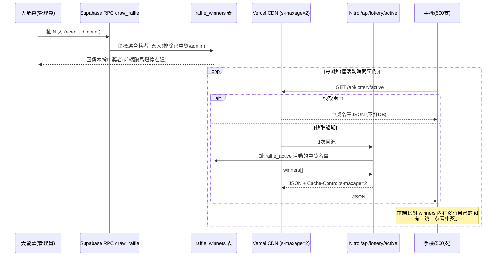
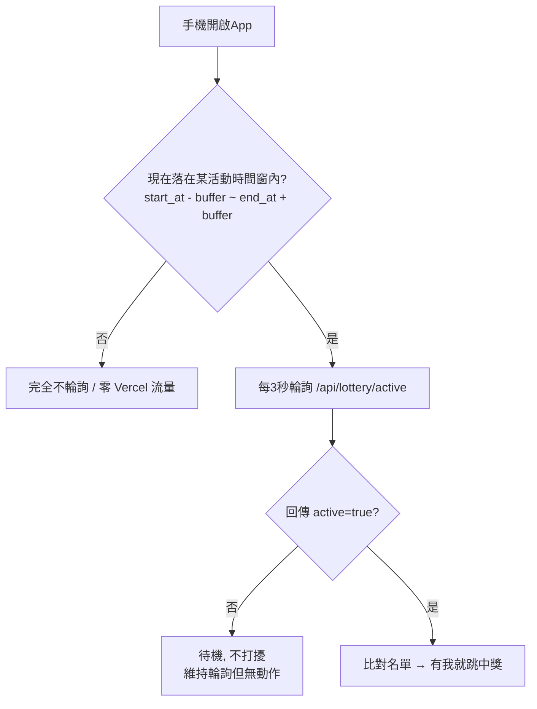

# 抽獎中獎即時通知 — 後端設計

- 日期：2026-06-24
- 範圍：**後端為主**（資料表、DB 函式、輪詢端點、快取與 gating 策略）。前端動畫與 UI 為後續另開。
- 狀態：設計已確認，待寫實作計畫。

## 1. 背景與目標

WLPEF Youth 活動（300~500 人）含抽獎環節：

- 點數 `>=` 活動門檻（`events.raffle_threshold`）者為合格者。
- 主辦方在大螢幕上控制開獎，畫面顯示抽獎過程與結果。
- 抽獎可多輪，**一次可抽 1~N 人**（彈性，預設安全上限 100）。
- 希望使用者手機**在 App 內**即時跳出「中獎通知」（不做背景推播）。
- 可接受延遲：3~5 秒。

### 限制與既有條件

- Supabase **免費版**：Realtime 同時連線上限 ~200 → 300~500 人會超標，**不採用 Realtime**。
- 前端部署於 **Vercel（免費 Hobby）**：需注意函式呼叫與流量額度。
- DB 已啟用 `pg_cron`、`pg_net`；已有 `is_admin()` 函式與 profiles RLS。
- 既有 `events.raffle_threshold`、`profiles.points` 可直接沿用；**目前無任何抽獎功能**（全新）。

### 核心設計原則

> **寫入（誰中獎）走 DB 函式保證公正；讀取（手機查詢）走 CDN 快取端點吸收流量。**
> 全程不碰 Realtime，徹底避開 200 連線限制；用 Vercel CDN 快取把回源流量壓到「每數秒約 1 次」。

## 2. 整體架構與資料流



關鍵：500 支手機都打 **Vercel CDN**，實際回源打到 Supabase 的只有「每 2 秒約 1 次」。

## 3. 資料表

### 3.1 新增 `raffle_winners`

| 欄位 | 型別 | 說明 |
|---|---|---|
| id | uuid pk (`gen_random_uuid()`) | |
| event_id | uuid → `events(id)` ON DELETE CASCADE | 哪場活動 |
| user_id | uuid → `profiles(id)` ON DELETE CASCADE | 中獎者 |
| round | int NOT NULL | 第幾輪（每抽一次 +1） |
| name | text | 抽中當下名字快照（顯示用） |
| points | int | 抽中當下點數快照（稽核用） |
| created_at | timestamptz DEFAULT now() | |

- `UNIQUE(event_id, user_id)` → DB 層強制「同活動不能中兩次」。
- 索引：`(event_id, round)` 供讀取端點與大螢幕查詢。

**RLS**：
- SELECT：登入者皆可讀（中獎名單本就公開於大螢幕）。讀取端點以 anon client 讀取也需此政策。
- INSERT/UPDATE/DELETE：僅 admin（實務上寫入只透過 `draw_raffle` RPC，`SECURITY DEFINER` 繞過 RLS，但仍設政策防止直接寫入）。

### 3.2 `events` 新增欄位

- `raffle_active BOOLEAN DEFAULT false` — 「現在哪場活動正在抽獎中」的開關（主辦切換）。同時間僅一場應為 true（由後台流程保證）。

## 4. 抽獎執行：Postgres 函式（RPC）

放在 DB 內的 `SECURITY DEFINER` 函式，**單一交易內完成「隨機抽 + 排除已中獎 + 寫入」**，原子、無競態、前端不可竄改。大螢幕以 `supabase.rpc('draw_raffle', { p_event_id, p_count })` 呼叫，**不需 Edge Function**。

邏輯：

1. 驗證呼叫者為 admin（用既有 `public.is_admin(auth.uid())`），否則 `raise exception`。
2. 驗證 `p_count` 為正整數且 `1 <= p_count <= 100`，否則 `raise exception`。
3. 取該活動 `raffle_threshold`；計算 `round = COALESCE(MAX(round),0)+1`。
4. 合格名單條件：
   - `profiles.points >= raffle_threshold`
   - `profiles.role <> 'admin'`（排除主辦）
   - 尚未在本活動中獎（`NOT EXISTS raffle_winners(event_id, user_id)`）
   - `ORDER BY random() LIMIT p_count`
5. `INSERT ... RETURNING *` 回傳本輪中獎者（含 name、points 快照）。

邊界：剩餘合格者少於 `p_count` 時，回傳實際抽到的（較少）筆數，不報錯。

### 4.1 合格名單讀取（大螢幕跑馬燈用）

大螢幕動畫需要合格者清單來滾名字。提供讀取型 RPC：

- `get_raffle_candidates(p_event_id uuid)` → 回傳合格者 `id, name`（同樣 admin 驗證、同合格條件，但**不寫入**）。
- 動畫本身 100% 前端：拿到名單後在前端亂滾，最後停在 `draw_raffle` 回傳的中獎者。此 API 純讀取、不影響即時性。

## 5. 手機輪詢端點（Nitro / Vercel）

新增 server route：`app/server/api/lottery/active.get.ts`

回傳格式：

```json
{
  "active": true,
  "eventId": "uuid",
  "round": 2,
  "winners": [
    { "userId": "uuid", "name": "王小明", "round": 2 }
  ]
}
```

- 無進行中抽獎時回 `{ "active": false }`。
- **快取標頭**：`Cache-Control: public, s-maxage=2, stale-while-revalidate=5` → Vercel CDN 擋掉絕大多數流量。
- 以 **anon key 在 server 端自建 supabase client** 讀取，**不可**使用帶 cookie 的 per-user client（否則回應個人化、CDN 不快取）。
- 回傳「全體中獎名單」，**「是不是我」比對在前端做** → 端點對所有人一致，才可被快取。
- 隱私：只輸出中獎者 `userId + name`（公開資訊，已於大螢幕揭示）；不輸出合格者全名單、不輸出點數。

## 6. 雙層 Gating（避免無謂輪詢 / 守住免費額度）



- **第一層（前端、零成本）**：手機本就有活動資料，用 `start_at`/`end_at` 加 **可調 buffer** 判斷「現在是否有活動」。沒有就**完全不輪詢**，把流量綁在活動當天那幾小時。
- **第二層（後端開關）**：`events.raffle_active` 為主辦的開關（大螢幕「開始/結束抽獎環節」切換）。時間窗內但未開時，手機僅待機。
- **buffer 可設定**：預設活動前後各 30 分鐘，做成可調設定值（runtime config / 常數），不寫死於邏輯散落各處。

## 7. 免費版額度 / 壓力 / 副作用

| 項目 | 評估 |
|---|---|
| Realtime 200 連線限制 | **完全避開**（不用 Realtime） |
| Supabase DB 壓力 | CDN 快取後回源約 30 次/分鐘 + 數次抽獎 RPC → **極低** |
| Supabase egress (5GB/月) | 手機打 Vercel CDN 非 Supabase，回源 JSON 僅幾 KB → 幾乎不耗 |
| Vercel Hobby 流量 (100GB/月) | 綁活動時間後：500 人 × 每 3 秒 × 約 2 小時 ≈ **1.2GB**、回源約 3,600 次函式呼叫 → 安全。若全天不 gating 會逼近 ~14GB/天可能爆額 → gating 為必要 |

**副作用 / 注意事項：**

1. **延遲**：`s-maxage=2` + 輪詢 3 秒 → 最壞約 5 秒內跳通知，符合可接受範圍 (b)。
2. **iOS 鎖屏 / 切背景**：瀏覽器凍結計時器、輪詢暫停；使用者重開頁面才補拿結果。因採「僅 App 內提示」，可接受。
3. **快取正確性**：該 route 嚴禁輸出個人化內容或設 cookie，否則 CDN 失效 → 已用「全體名單 + 前端比對」規避。
4. **多人同時操作後台**：round 編號理論上可能撞號，單一主持人操作風險極低，先不處理（必要時加 advisory lock）。
5. **冷啟動**：Vercel 函式首次回源可能多 1~2 秒延遲，之後轉熱。

## 8. 後端交付清單（實作範圍）

1. Migration：`raffle_winners` 表 + 索引 + RLS；`events.raffle_active` 欄位。
2. Migration：RPC `draw_raffle(p_event_id, p_count)`（含 admin 驗證、count 1~100、排除 admin/已中獎、round 遞增）。
3. Migration：RPC `get_raffle_candidates(p_event_id)`（讀取合格名單）。
4. Nitro route：`app/server/api/lottery/active.get.ts`（anon client 讀取 + 快取標頭）。
5. 可調設定：gating buffer（預設 ±30 分）、輪詢間隔（3 秒）、s-maxage（2 秒）集中管理。
6. 文件：更新 `docs/PROJECT_GUIDE.md`、`README.md`（若新增環境變數）、`supabase/full_schema.sql`。

## 9. 明確排除（YAGNI / 後續）

- 背景推播（Web Push / Service Worker）—— 本期不做。
- 未中獎者狀態顯示 —— 不做（僅中獎才跳）。
- 前端大螢幕動畫與手機通知 UI —— 另開設計／計畫。
- 合格名單需「報名 / 簽到」條件 —— 不做，只看 `points >= 門檻`。
- advisory lock 防 round 撞號 —— 暫不做。
